

<h1>🛒 SQL Data Analysis using MySQL</h1>

<h2>📌 Project Overview</h2>

This project demonstrates <b>SQL Data Analysis</b> using <b>MySQL Workbench</b> on an
<b>E-commerce Database</b>. It covers the complete lifecycle of database development,
including database creation, table design, data insertion, querying, reporting,
views, and indexing.

The project is designed to strengthen SQL skills by implementing real-world business
scenarios such as customer analysis, sales analysis, product analysis, and payment tracking.

<h2>🎯 Objectives</h2>

<ul>
<li>Create a relational database using MySQL.</li>
<li>Design normalized tables with Primary and Foreign Keys.</li>
<li>Insert sample business data.</li>
<li>Perform SQL data analysis.</li>
<li>Generate business reports using SQL queries.</li>
<li>Learn SQL Joins, Subqueries, Aggregate Functions, Views, and Indexes.</li>
</ul>

<h2>🛠 Technologies Used</h2>

<table>
<tr>
<th>Technology</th>
<th>Purpose</th>
</tr>

<tr>
<td>MySQL Server</td>
<td>Database</td>
</tr>

<tr>
<td>MySQL Workbench</td>
<td>SQL Development</td>
</tr>

<tr>
<td>SQL</td>
<td>Query Language</td>
</tr>

</table>

<h2>🗄 Database Name</h2>

<pre>
ecommerce
</pre>

<h2>📂 Database Structure</h2>

<pre>
ecommerce
│
├── customers
├── categories
├── products
├── orders
├── order_items
└── payments
</pre>

<h2>🧱 Database Schema</h2>

<pre>
Customers
    │
    │ customer_id
    ▼
Orders
    │
    │ order_id
    ▼
Order_Items
    ▲
    │ product_id
Products
    │
    │ category_id
    ▼
Categories

Orders
    │
    ▼
Payments
</pre>

<h2>📋 Tables</h2>

<h3>👤 Customers</h3>

Stores customer details.

<table>
<tr>
<th>Column</th>
</tr>

<tr><td>customer_id</td></tr>
<tr><td>customer_name</td></tr>
<tr><td>email</td></tr>
<tr><td>city</td></tr>
<tr><td>state</td></tr>

</table>

 

<h3>📦 Categories</h3>

Stores product categories.

<table>

<tr>
<th>Column</th>
</tr>

<tr><td>category_id</td></tr>
<tr><td>category_name</td></tr>

</table>

 

<h3>🛍 Products</h3>

Stores available products.

<table>

<tr>
<th>Column</th>
</tr>

<tr><td>product_id</td></tr>
<tr><td>product_name</td></tr>
<tr><td>category_id</td></tr>
<tr><td>price</td></tr>
<tr><td>stock</td></tr>

</table>

 

<h3>📑 Orders</h3>

Stores customer orders.

<table>

<tr>
<th>Column</th>
</tr>

<tr><td>order_id</td></tr>
<tr><td>customer_id</td></tr>
<tr><td>order_date</td></tr>
<tr><td>total_amount</td></tr>

</table>

 

<h3>🛒 Order Items</h3>

Stores purchased products.

<table>

<tr>
<th>Column</th>
</tr>

<tr><td>item_id</td></tr>
<tr><td>order_id</td></tr>
<tr><td>product_id</td></tr>
<tr><td>quantity</td></tr>
<tr><td>price</td></tr>

</table>

 

<h3>💳 Payments</h3>

Stores payment details.

<table>

<tr>
<th>Column</th>
</tr>

<tr><td>payment_id</td></tr>
<tr><td>order_id</td></tr>
<tr><td>payment_method</td></tr>
<tr><td>payment_status</td></tr>

</table>

<h2>📊 Sample Data</h2>

<table>

<tr>
<th>Table</th>
<th>Records</th>
</tr>

<tr><td>Customers</td><td>20</td></tr>
<tr><td>Categories</td><td>5</td></tr>
<tr><td>Products</td><td>30</td></tr>
<tr><td>Orders</td><td>25</td></tr>
<tr><td>Order Items</td><td>50</td></tr>
<tr><td>Payments</td><td>25</td></tr>

</table>

<h2>🚀 SQL Operations Performed</h2>

<h3>✅ Basic Queries</h3>

<ul>
<li>SELECT</li>
<li>WHERE</li>
<li>ORDER BY</li>
<li>GROUP BY</li>
</ul>

<h3>📈 Aggregate Functions</h3>

<ul>
<li>COUNT()</li>
<li>SUM()</li>
<li>AVG()</li>
<li>MAX()</li>
<li>MIN()</li>
</ul>

<h3>🔗 SQL Joins</h3>

<ul>
<li>INNER JOIN</li>
<li>LEFT JOIN</li>
<li>RIGHT JOIN</li>
<li>Multiple Table JOIN</li>
</ul>

<h3>🔍 Subqueries</h3>

<ul>
<li>Products priced above average</li>
<li>Customers with more than two orders</li>
</ul>

<h3>📊 Business Analysis</h3>

<ul>
<li>Sales by Category</li>
<li>Top Selling Products</li>
<li>Monthly Sales</li>
<li>Highest Spending Customer</li>
<li>Pending Payments</li>
<li>Out of Stock Products</li>
</ul>

<h2>👁 SQL View</h2>

<b>Created View</b>

<pre>
customer_orders
</pre>

<h2>⚡ Indexes</h2>

<b>Created Indexes</b>

<pre>
idx_customer
idx_product
</pre>

<h2>📁 Project Structure</h2>

<pre>
SQL_Data_Analysis/
│
├── ecommerce.sql
├── ecommerce_analysis.sql
├── README.md
│
└── screenshots/
    ├── database_tables.png
    ├── select.png
    ├── where.png
    ├── orderby.png
    ├── groupby.png
    ├── innerjoin.png
    ├── leftjoin.png
    ├── rightjoin.png
    ├── subquery.png
    ├── aggregate.png
    ├── view.png
    ├── indexes.png
    └── final_analysis.png
</pre>

<h2>📸 Project Screenshots</h2>

<table>

<tr>
<th>Screenshot</th>
<th>Image</th>
</tr>

<tr><td>Database Tables</td><td>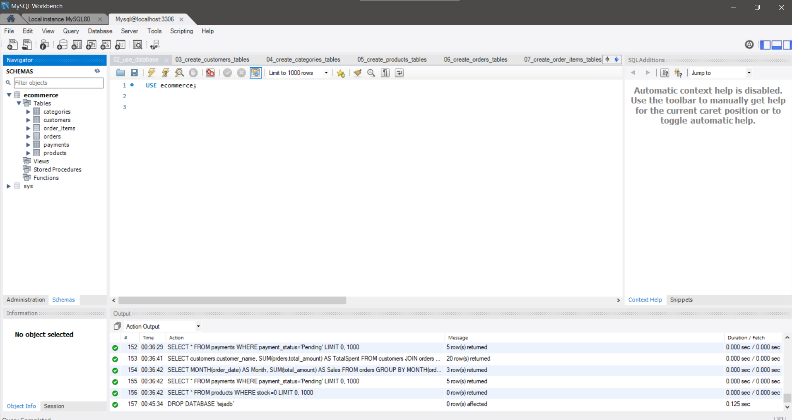</td></tr>

<tr><td>SELECT Query</td><td>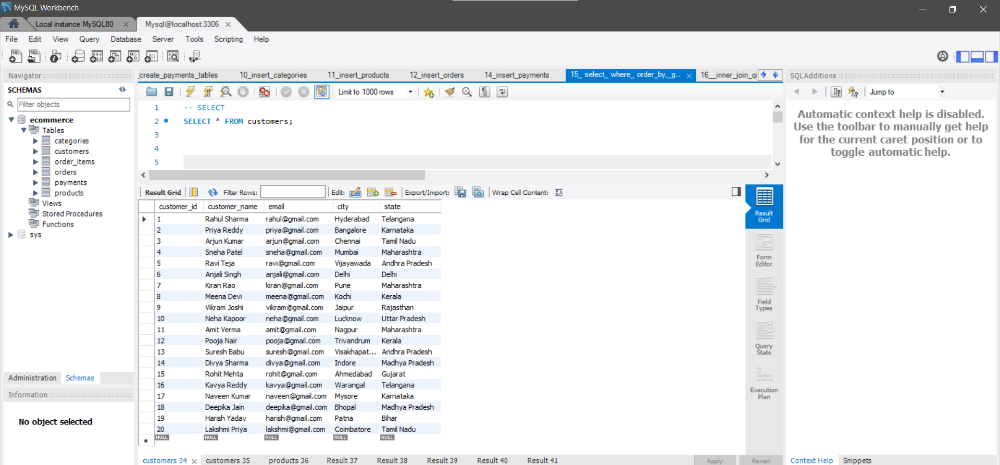</td></tr>

<tr><td>WHERE Query</td><td>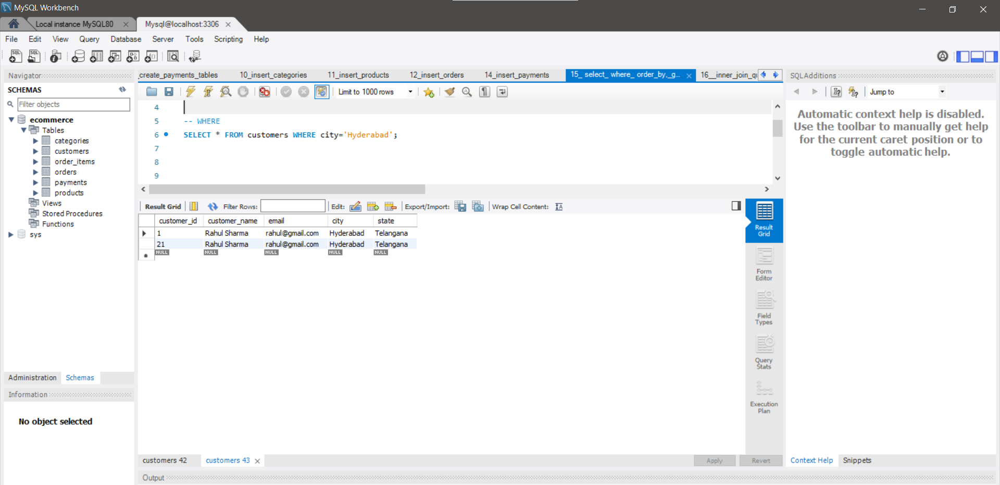</td></tr>

<tr><td>ORDER BY Query</td><td>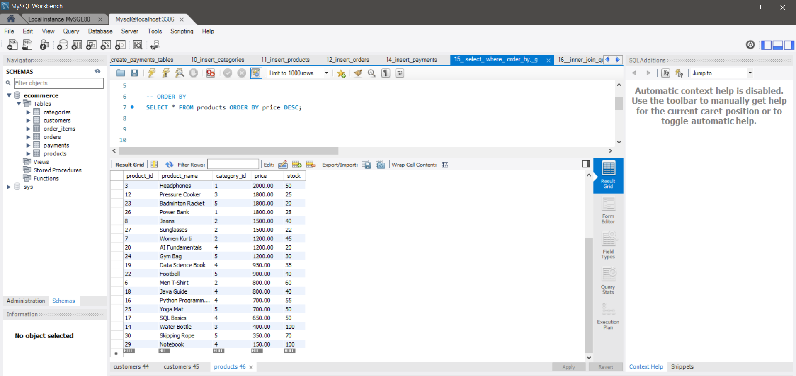</td></tr>

<tr><td>GROUP BY Query</td><td>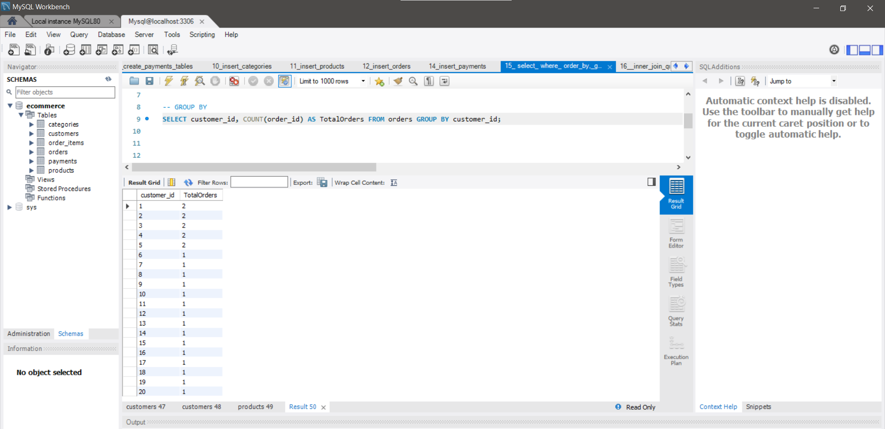</td></tr>

<tr><td>INNER JOIN</td><td>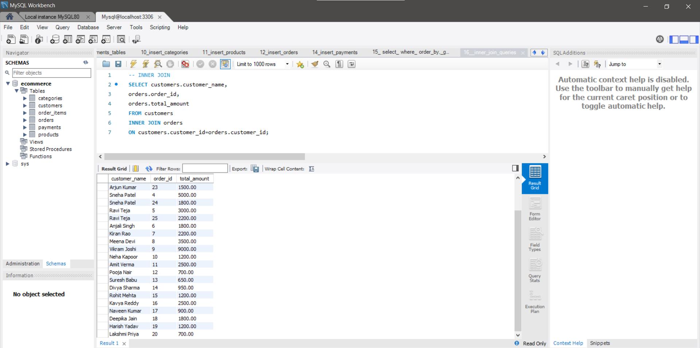</td></tr>

<tr><td>LEFT JOIN</td><td>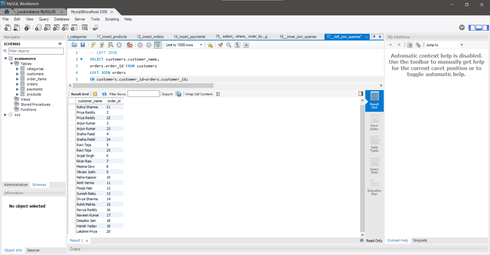</td></tr>

<tr><td>RIGHT JOIN</td><td>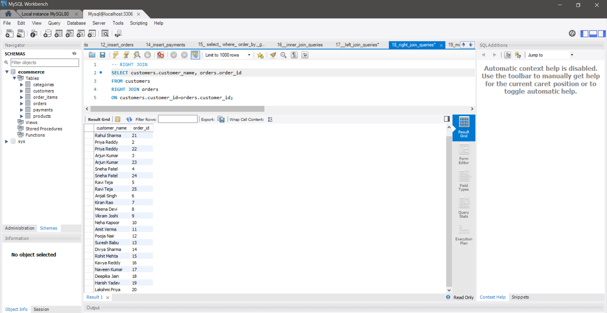</td></tr>

<tr><td>Subquery</td><td>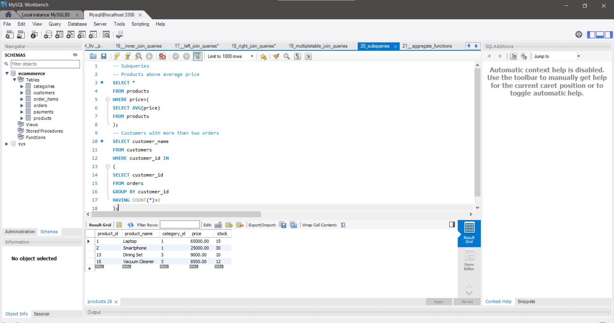</td></tr>

<tr><td>Aggregate Analysis</td><td>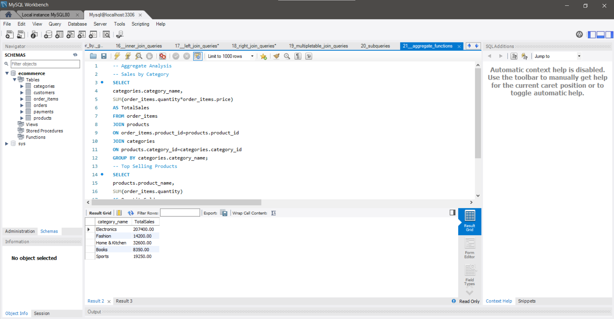</td></tr>

<tr><td>View Output</td><td>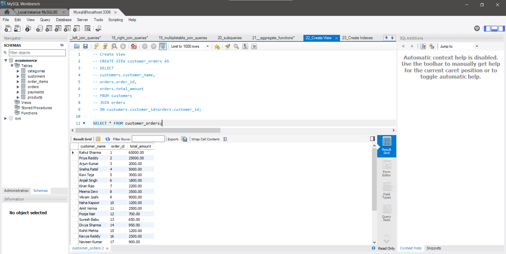</td></tr>

<tr><td>Final Analysis</td><td>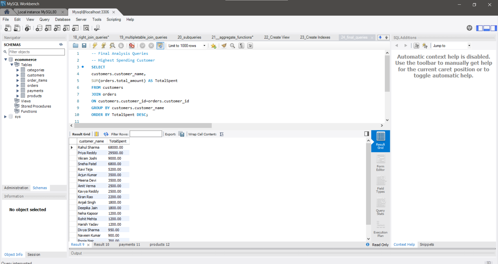</td></tr>

</table>

<h2>🎓 Learning Outcomes</h2>

<ul>
<li>Relational Database Design</li>
<li>Primary Keys & Foreign Keys</li>
<li>Data Manipulation</li>
<li>SQL Queries</li>
<li>Aggregate Functions</li>
<li>SQL Joins</li>
<li>Subqueries</li>
<li>Views</li>
<li>Indexes</li>
<li>Business Data Analysis</li>
<li>MySQL Workbench</li>
</ul>

<h2>📚 SQL Concepts Covered</h2>

<ul>
<li>Data Definition Language (DDL)</li>
<li>Data Manipulation Language (DML)</li>
<li>Data Query Language (DQL)</li>
<li>Aggregate Functions</li>
<li>SQL Joins</li>
<li>Subqueries</li>
<li>Views</li>
<li>Indexes</li>
<li>Business Reporting</li>
</ul>

<h2>📌 Conclusion</h2>

This project demonstrates the practical implementation of SQL for business data analysis
using an E-commerce database. It covers the complete workflow from database creation
to advanced analytical queries, providing valuable experience in writing efficient SQL
queries and generating meaningful business insights.

This project is suitable for academic submissions, interview preparation,
and showcasing SQL skills in a professional portfolio.

<h3>⭐ If you found this project helpful, don't forget to Star the repository!</h3>

